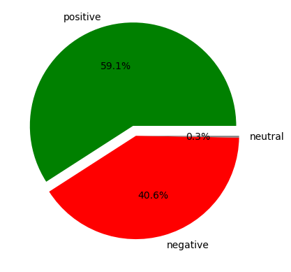

# BRITISH-AIRWAYS-AIRLINE-REVIEW-ANALYSIS : PROJECT OVERVIEW
- Created a dataframe and scraped over 3000 British airway customer reviews from skytrax using python and Beautiful soup.
- performed sentiment analysis on the scrapped data
 
# Code and Resources used
- Python Version: 3.7
- Packages: pandas, numpy, sklearn, matplotlib, seaborn, Beautiful Soup, nltk

# Web Scraping
the data was scrapped into the following column
- Customer Name
- Traveller
- Seat type
- Region
- Date
- Airline
- Title
- Rating
- Date Flown
- Recommended
- Review
 
# Key topics
- The frequency chart below shows that the key topics within the reviews include “service”, “seat”, “crew” and “food”, showing that 
people are actively talking about their experience and hospitality

.png)

# Sentiment Analysis

With Sentiment analysis performed on the scrapped data, we could see the sentiment of the customers reviews 
- Out of over 3000 reviews, 59.1% were positive, 40.6% were negative and 0.3% were neutral. 
- This means the majority of reviews were polarised as either positive or negative
  

